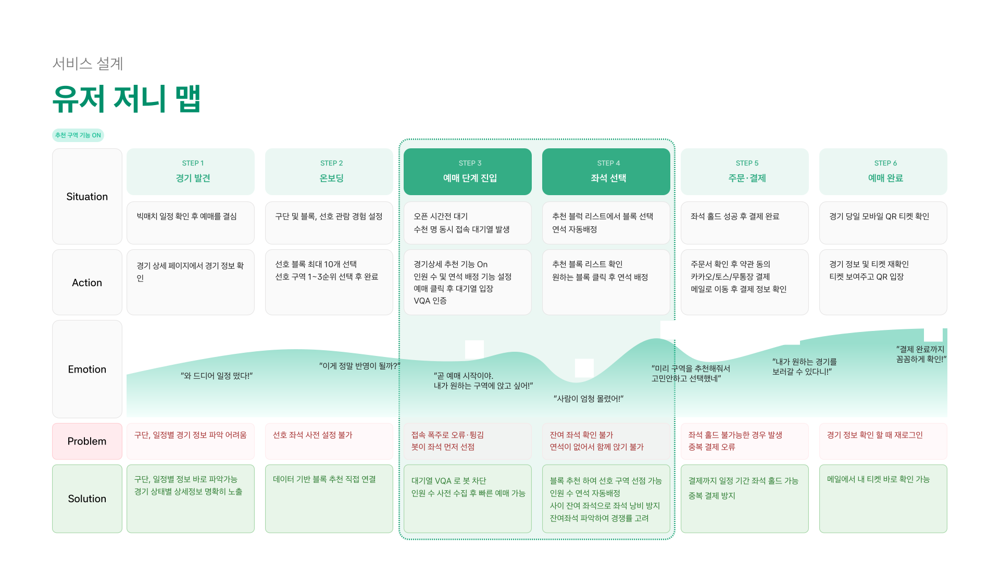
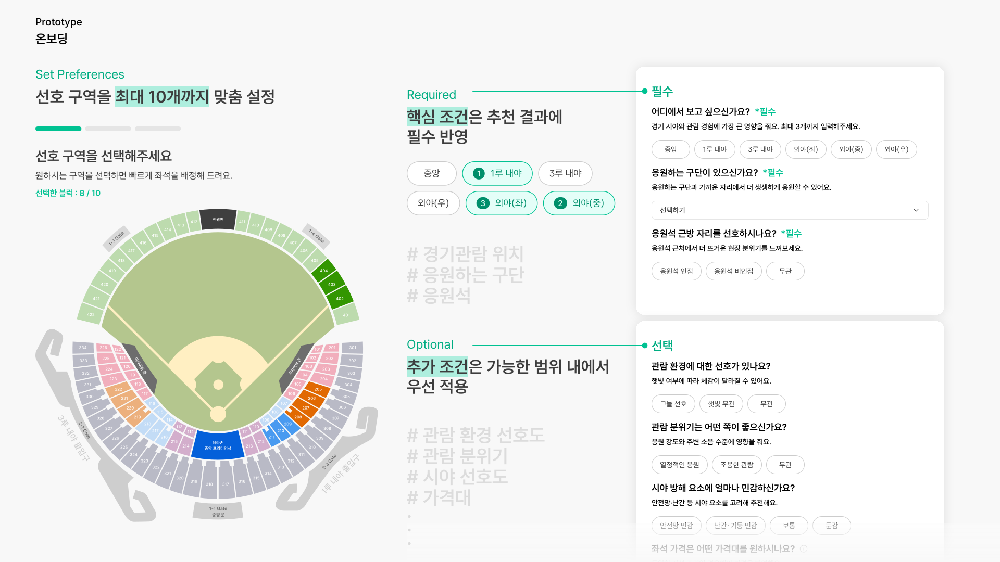

# 구름공방 · Playball

  

  <b>야구 티켓팅 플랫폼 Playball</b> 
  <i>대규모 트래픽에서도 원하는 자리를 쉽고 빠르게</i>

  
  

---

## Team

###  Team Leads

|                           팀장 · 백엔드 리드 · 개발 그룹장                            |                            부팀장 · 기획 그룹장                             |
|:---------------------------------------------------------------------:|:------------------------------------------------------------------:|
|               |               |
|       강슬기   [@Seulgi0117](https://github.com/Seulgi0117)        |         김제현   [@j-hyunn](https://github.com/j-hyunn)          |

### Backend (BE) · Fullstack (FS)

|              JWT 인증 / 인가 · 추천 좌석 알고리즘 · 티켓팅 서버 구현              |                       티켓팅 · 주문 서버 구현                        |                    대기열 서버 구현 · OAuth 연동 · 시큐어코딩                    |
|:-------------------------------------------------------------:|:---------------------------------------------------------------:|:------------------------------------------------------------------:|
|     |           |              |
|  강슬기   [@Seulgi0117](https://github.com/Seulgi0117)   |       유의진   [@ejinn1](https://github.com/ejinn1)       |         황시연   [@siyeon13](https://github.com/siyeon13)         |

### Frontend (FE)

|                                   프론트엔드 총괄                                    |
|:---------------------------------------------------------------------:|
|                 |
|         최광혁   [@806hyogi](https://github.com/806hyogi)         |

### Cloud Native (CN)

|                      클라우드보안 그룹장 · CN 파트장                       |                        CI / CD 파이프라인 (TeamCity)                         |                         모니터링 · 시각화 · 알림 체계 (Grafana)                         |
|:---------------------------------------------------------------:|:----------------------------------------------------------------------:|:------------------------------------------------------------------------:|
|          |              |                  |
|      이원이   [@212clab](https://github.com/212clab)      |        정재형   [@Chemuchi](https://github.com/Chemuchi)         |          정지혜   [@jjyeah](https://github.com/jjyeah)           |

### Security (SC)

|                        보안 파트장 · 모의 해킹 · 보안 총괄                        |                        보안 인프라 · 운영 보안                         |                               인증 / 인가 · 앱단 보안                                |
|:---------------------------------------------------------------:|:-----------------------------------------------------------:|:----------------------------------------------------------------------------:|
|         |       |             |
|     정민욱   [@hapumpum](https://github.com/hapumpum)      |    정완우   [@hej-13](https://github.com/hej-13)     | 안지서   [@vanillacustardcream](https://github.com/vanillacustardcream)  |

### AI

|                         AI 파트장 · AI 공격 에이전트 구현                         |                               AI 방어 서버 구축                               |
|:---------------------------------------------------------------------:|:---------------------------------------------------------------------:|
|                 |               |
|         장지현   [@wkdwlgus](https://github.com/wkdwlgus)         |        최동훈   [@DDong-Gosu](https://github.com/DDong-Gosu)         |

### Product Design (PD)

| 이름 | 담당 |
| --- | --- |
| 박세영 | 프로덕트 디자인 그룹장 |
| 윤정빈 | 디자인 파트장 |

---

## 목차

- [Brand Message](#brand-message)
- [프로젝트 개요](#프로젝트-개요)
- [시장 문제와 솔루션](#시장-문제와-솔루션)
- [비즈니스 임팩트](#비즈니스-임팩트)
- [유저 저니 맵](#유저-저니-맵)
- [주요 기능](#주요-기능)
- [기술 스택](#기술-스택)
- [레포지토리](#레포지토리)
- [링크](#링크)
- [Team](#team)

---

## Brand Message

> **Play Ball!**
> 야구 경기 시작을 알리기 위해 심판이 외치는 신호.
> 경기가 시작되는 순간처럼 티켓팅 또한 **지금 시작된다**는 긴장감과 속도를 가지고 있습니다.

---

## 프로젝트 개요

| 항목 | 내용 |
| --- | --- |
| 프로젝트 명 | **Playball** |
| 주제 | **Traffic-Master: AI 기반 대규모 티켓팅 플랫폼** |
| 개발 기간 | 2026.01.14 (수) ~ 2026.04.21 (화) |
| 소속 | **kt cloud TECH UP 1기 · 실무통합 프로젝트** |
| 배포 사이트 | [playball.one](https://playball.one/) |
| 프로젝트 인원 | 총 16명 (기획·디자인·개발·클라우드·보안·AI) |

Playball은 kt cloud TECH UP 1기 실무통합 프로젝트의 **PROJECT 2 "Traffic-Master"** 주제를 선택해, 기획·디자인·개발·클라우드·보안·AI 9개 과정이 협업하여 완성한 야구 티켓팅 서비스입니다.

- **핵심 가치**: 뚫으려는 AI 매크로와 막으려는 AI 방패의 **대규모 트래픽 전쟁**
- **목표**: 15,000석 규모의 트래픽 폭주 상황을 **기술적으로 제어**하고 매크로를 **능동적으로 차단**
- **주요 기술 키워드**: Extreme Concurrency (동시성 제어) · In-memory 컴퓨팅 · Canvas/WebGL 좌석 렌더링 · 생성형 보안 퀴즈(VQA) · KEDA 기반 예측형 오토스케일링

---

## 시장 문제와 솔루션

### 2025 KBO 시장 — 관중은 늘었지만, 구조적 문제도 함께 커졌다

2025 KBO 총 관중 **12,312,519명** · 좌석 점유율 **82.9%** · 경기당 평균 **17,101명** · 연간 티켓 시장 약 **1,290억 원**.
2년 연속 최다 관중 갱신, 2030 여성 팬층 유입, ABS·피치클락 등 KBO 시스템 고도화로 리그 신뢰도는 상승했지만, 티켓팅 경험은 여전히 구조적 문제를 안고 있습니다.

### 현재 스포츠 티켓팅의 구조적 문제

| Pain Point | 현상 |
| --- | --- |
| **암표 시장 과열** | 1·2차 티켓 구매 경험자의 **36%가 2차 판매(암표) 구매**, 36.5%는 구매 고려 (마크로밀엠브레인 조사) |
| **매크로 / 봇 공격** | 단순 봇·자동화 봇·Residential Proxy 고급 봇까지 — 전통 탐지 규칙은 오탐·미탐 트레이드오프에 갇힘 |
| **자동배정 불만족** | 결제 전까지 좌석 위치 확인 불가 · 관람 경험 저하 |
| **직접 선택의 비효율** | 빠른 확보 우선으로 좌석이 띄엄띄엄 확보되어 **연석 확보 어려움** · 네트워크 빠른 사용자만 유리한 불공정 |

### 솔루션 — 분산 추천으로 수요 분포 재설계

> **온보딩 선호 수집 → 추천 구역 기반 티켓팅 → 구역 내 좌석 자동 배정**

- **온보딩**에서 사용자 선호 구역 · 응원 구단 · 관람 환경을 수집
- **추천 구역 기반 티켓팅**으로 온보딩 데이터와 인원 수 기반 구역을 자동 추천
- **구역 내 좌석 랜덤 배정**으로 핫스팟 경합을 블록 단위로 분산

핫스팟에 집중되던 트래픽을 선호 기반 블록으로 분산시켜 **구조적 경합을 해소**합니다.

---

## 비즈니스 임팩트

| 이해관계자 | 가치 |
| --- | --- |
| **팬 (B2C)** | 원하는 구역 연석 확보 성공률 ↑ · 2차 티켓 구매 비용 절감 · 구매 비효율 개선 |
| **운영사 (B2B)** | 동일 좌석 대비 판매율 ↑ · 빅매치 장애 리스크 감소 · 서버 비용 저하 |
| **구단 (B2B)** | CS / 환불 민원 감소 · 팬 경험 표준화 · 경기별 예매 데이터 인사이트 |
| **KBO (시장)** | 리그 신뢰도 ↑ · 신규 팬층 이탈 방지 · 정상 예매 생태계 복원 |

---

## 유저 저니 맵

  

빅매치 일정 확인 → 온보딩 → 예매 단계 진입 → 좌석 선택 → 주문·결제 → 예매 완료까지, 각 단계의 Pain Point를 서비스 경험으로 해소합니다.

---

## 주요 기능

### 1. 온보딩 — 나만의 좌석 기준 저장

  

- 좌석맵에서 **선호 블록을 최대 10개** 직접 선택
- **필수 조건**: 뷰포인트 1~3순위 · 응원 구단 · 응원석 근접 선호 → 추천 결과에 필수 반영
- **선택 조건**: 관람 환경 · 응원 분위기 · 시야 민감도 · 가격대 → 가능한 범위에서 우선 적용
- 한 번 설정한 선호는 다음 예매부터 자동 적용 — 매번 새로 고르지 않아도 됨

### 2. 경기 상세 — 추천 구역을 한눈에

  

- 구단·일정별 경기 정보를 상세 페이지에서 즉시 확인
- **설정한 선호도에 맞는 구역을 먼저 보여드려요** — 고민 시간을 줄이는 개인화 추천
- 인원 수 설정으로 **연석 배정 자동화** (예: 4인 요청 시 연속된 4자리 우선)
- **접속 폭주에도 순번 보장**, 이탈 없는 대기 경험
- **VQA(시각 질의응답) 인증** — 문자 캡차와 달리 사람처럼 드래그·타이밍 맞추기로 매크로·봇 자동 풀이 방지
- **예매 전 사전 보안 인증 체험** — 실전 전 VQA 조작법을 미리 익힌 뒤 본 티켓팅 진입

### 3. 티켓 예매 — 긴장되는 순간, 빠른 판단을 돕는 경험

  

- **추천 구역 리스트**에서 블록만 고르면 **연석 좌석이 자동 배정**
- 블록별 **이용 가능 연석 수**를 표시해 선택 가이드 제공
- 네트워크 속도 경쟁이 아니라, 공정한 자동 배분 구조로 **"먼저 클릭한 사람이 먹는"** 불공정 해소
- 추천 기능 OFF 시에는 최대 8석까지 직접 선택도 가능 (기존 방식 호환)

### 4. AI 공격 / 방어 에이전트

> **공격자가 되어 방어를 검증한다** — 기존 AI 방어의 맹점을 스스로 뚫어보며 약점을 보완.

- **AI 공격 에이전트**: 사람 궤적 재현(곡선·미세 떨림) · VQA 자동 풀이 · 여러 에이전트가 한 팀처럼 움직이는 스웜 · LLM 코디네이터가 전략 실시간 조정
- **AI 방어 에이전트**: 실시간 행동 분석으로 위험도 판정 + VQA 필수 게이트로 이중 검증 + LLM 사후 판단으로 탐지 기준 자동 개선
- **지속적 검증 루프**: 공격이 방어를 뚫으면 방어 정책 자동 업데이트 → 다시 공격 → 다시 개선

---

## 기술 스택

### Backend

| 분류 | 스택 |
| --- | --- |
| **Language / Framework** |     |
| **Database / ORM** |    |
| **Cache / Concurrency** |    |
| **Messaging (EDA)** |  |
| **Security / Auth** |     |
| **Resilience / Observability** |     |
| **Test** |  |

### Frontend

| 분류 | 스택 |
| --- | --- |
| **Framework / Language** |   |
| **UI** |   |
| **Component** |   |
| **State** |  |
| **Date** |   |
| **Observability** |    |
| **Mocking** |  |
| **Build** |   |

### AI

| 분류 | 스택 |
| --- | --- |
| **Language** |  |
| **API 서버** |   |
| **세션 상태** |  |
| **ORM / DB** |    |
| **감사 분석 DB** |  |
| **오브젝트 스토리지** | [-569A31?style=for-the-badge&logo=amazons3&logoColor=white)](https://boto3.amazonaws.com/v1/documentation/api/latest/index.html) |
| **AI 워크플로우** |  |
| **LLM** |  |
| **인증** |  |
| **모니터링** |   |
| **추적** |  |
| **로깅** |  |
| **빌드** |   |
| **테스트** |  |
| **린팅** |   |

### Cloud · Infra

> 버전은 실제 Staging/Prod에 적용된 차트·서비스 기준

| 분류 | 스택 |
| --- | --- |
| **Cloud (AWS)** |        |
| **Service Mesh** |  |
| **IaC** |  |
| **CI / CD** |     |
| **Scaling** |    |
| **권한 · 시크릿** |    |
| **Observability** |         |
| **정책 · 보안** |   |
| **운영 확인** |    |

### Design

| 분류 | 스택 |
| --- | --- |
| **Tool** |  |
| **Typography** |  |

---

## 레포지토리

| 영역 | Repository |
| --- | --- |
| **프론트엔드** | [101-goormgb-frontend](https://github.com/goorm-gongbang/101-goormgb-frontend) |
| **백엔드** | [102-goormgb-backend](https://github.com/goorm-gongbang/102-goormgb-backend) |
| **AI 방어 서버** | [201-goormgb-ai](https://github.com/goorm-gongbang/201-goormgb-ai) |
| **AI 공격 서버** | [203-goormgb-ai-attack](https://github.com/goorm-gongbang/203-goormgb-ai-attack) |
| **테라폼** | [301-playball-terraform](https://github.com/goorm-gongbang/301-playball-terraform) |
| **부트스트랩** | [302-goormgb-k8s-bootstrap](https://github.com/goorm-gongbang/302-goormgb-k8s-bootstrap) |
| **헬름** | [303-goormgb-k8s-helm](https://github.com/goorm-gongbang/303-goormgb-k8s-helm) |
| **성능(부하)테스트** | [304-goormgb-k6-operators](https://github.com/goorm-gongbang/304-goormgb-k6-operators) |
| **Teamcity(CICD)** | [306-goormgb-teamcity](https://github.com/goorm-gongbang/306-goormgb-teamcity) |

---

## 링크

| 항목 | URL |
| --- | --- |
| 서비스 운영 | [playball.one](https://playball.one/) |
| 프로젝트 Docs | [docs.playball.one](https://docs.playball.one/planning/overview) |
| WBS | [Google Sheets](https://docs.google.com/spreadsheets/d/1axI4Ynw2SzQXTDA9udrfF_bvB5g_KfeJ8SLNYf0UtSE/edit?usp=sharing) |
| QA 시트 | [Google Sheets](https://docs.google.com/spreadsheets/d/13FvuJ2gUbNocKz6nOm2aRKB3uSNBFATWn5DN3W8KRUY/edit?gid=0#gid=0) |
| 구름공방 노션 | [Notion](https://www.notion.so/4-2e79e3e335cc8032979bc17eb053e93a?source=copy_link) |
| 개발팀 기술 문서 · 그라운드 룰 · 명세 · 작업 계획서 | [Notion](https://www.notion.so/2ed9e3e335cc801ea7bae1cf7378e707?source=copy_link) |

---

© 2026 구름공방 
